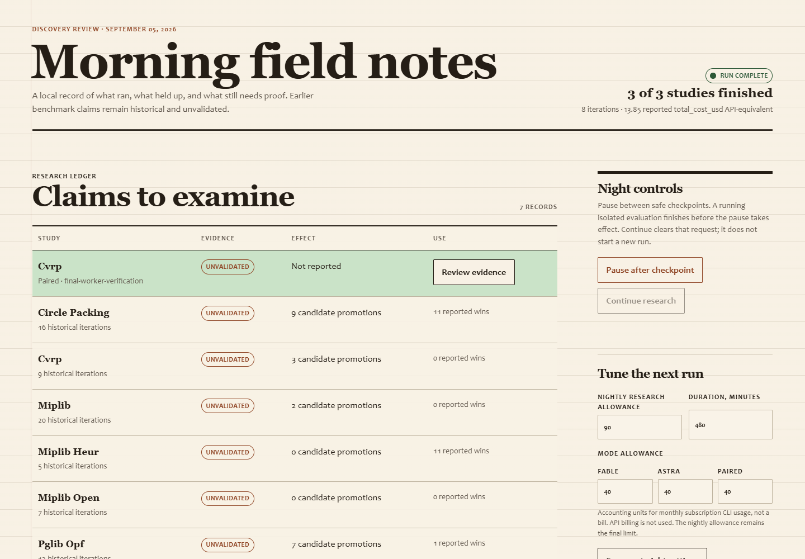
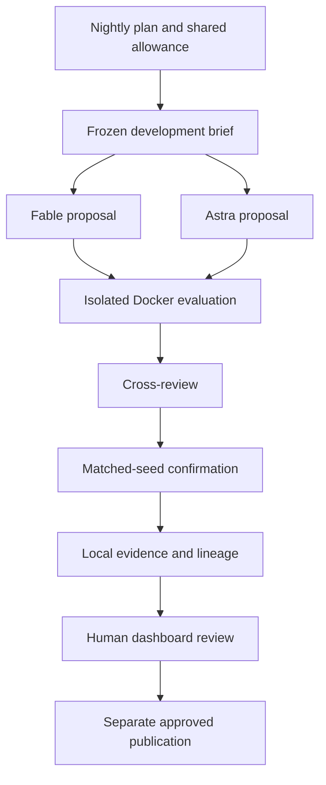

<div align="center">

# Discovery Loop

**A local optimization research lab with subscription-only model routing.**

[](https://arxiv.org/abs/2609.05093)
[](https://github.com/ucsandman/discovery-loop/actions/workflows/verify.yml)


[](LICENSE)

[Paper](https://arxiv.org/abs/2609.05093) · [Quick start](#developer-setup) · [How it works](#how-an-experiment-works) · [Results](#published-result-circle-packing) · [Nightly routine](#nightly-integration) · [Documentation](docs/README.md) · [Contributing](CONTRIBUTING.md)

</div>

> **Published result:** [*LLM-Guided Program Evolution for Circle Packing: Breaking 10 Packomania Records for $28*](https://arxiv.org/abs/2609.05093) (arXiv:2609.05093). Discovery Loop improved the best-known solutions for **10 values of N in the range 101–114** on the Packomania [csqv benchmark](https://www.packomania.com/csqv/csqv.html), by **2.4%–5.4%** over prior records, all within **15 iterations** and at a total LLM cost of **$27.72**. The results were independently reviewed and accepted by Packomania. See [Published result: circle packing](#published-result-circle-packing).

A local research lab for improving optimization solvers. A configured subscription route selects among Fable, Opus, Astra and Sol; isolated workers execute proposed programs; independent mathematical checks and matched-seed experiments decide what survives. Benchmark progress is kept separate from claims of real-world benefit.



*The local dashboard with real run data. Historical results are labeled unvalidated; the preview is not evidence of a confirmed discovery.*

| Capability | What it gives you |
| --- | --- |
| Independent proposals | The scheduled trial records Fable, Astra or paired requested arms; paired work starts from the same frozen development brief and cross-reviews promising candidates. |
| Reproducible comparisons | Matched targets and seeds, independent feasibility checks and a recorded immutable worker image. |
| Bounded overnight work | A shared allowance, checkpoints, pause controls and an explicit deadline. |
| Human review | Evidence inspection and approvals bound to exact files, with no automatic publication. |

> **Release status:** The pipeline and dashboard are implemented. The operator installation activated the Windows research, morning-integration and dashboard tasks on 2026-09-05, with rollback backups. New installations still preview before applying task changes. No sealed release dataset or validated real-world impact claim is available.

## Published result: circle packing

The one problem that has cleared external review is circle packing. Discovery Loop evolved a solver for the Packomania **csqv** benchmark (variable-sized circles in a unit square, maximize the sum of radii) and improved the best-known solutions for **10 values of N**: 101, 102, 103, 105, 106, 107, 108, 109, 111 and 114. Gains ran **2.4%–5.4%** over the prior records, reached within **15 iterations**, at a total LLM cost of **$27.72**.

The solutions were submitted to and accepted by [Packomania](https://www.packomania.com/csqv/csqv.html), the long-running database of best-known circle packings. Packomania reference [14] credits *"Wes Sander, MoltFire, discovery-loop and private communication, September 2026."*

| Resource | Link |
| --- | --- |
| Paper | [arXiv:2609.05093](https://arxiv.org/abs/2609.05093) ([PDF](https://arxiv.org/pdf/2609.05093)) |
| Benchmark | [Packomania csqv](https://www.packomania.com/csqv/csqv.html) |
| Accepted solutions | [`best/`](best/) (Packomania `.pck` submission files) |

This is the only domain in the repository with an externally accepted, published result. The other problem plugins (`miplib_heur`, `miplib_open`, `pglib_opf`, `cvrp`) remain benchmark-only and are explicitly treated as unvalidated; see [Problems](#problems) and the [research portfolio](docs/RESEARCH-PORTFOLIO.md).

## Morning review

Open **dashboard.cmd** on Windows, or visit **http://localhost:8766** when the dashboard is running.

The dashboard shows completed work, incomplete stages, legacy observations, paired evidence, and the 14-night model comparison. You can request a pause, continue research, tune the next night's allowance, inspect evidence, and queue approval for an exact release. Continue clears a pause request; it does not start a new run. Approval is local and does not send messages or push results.

Historical scores remain visible as **unvalidated**. In particular, the earlier power-grid improvement depended on numerical tolerance and is not treated as a scientific discovery.

“Mark for morning review” saves a human review bookmark and includes the problem in the morning report. It does not launch an extra model call.

## Developer setup

Clone this repository and open a terminal in its root. Requires Python 3.12, Docker with Linux containers, and the locally installed Claude and Codex CLIs authenticated through their subscriptions.

```powershell
python -m venv .venv
.venv\Scripts\Activate.ps1
python -m pip install -r requirements-dev.txt
docker build -f worker.Dockerfile -t discovery-loop-worker:local .
python dashboard.py --open
```

<details>
<summary>Linux / macOS setup</summary>

```bash
python3.12 -m venv .venv
source .venv/bin/activate
python -m pip install -r requirements-dev.txt
docker build -f worker.Dockerfile -t discovery-loop-worker:local .
python dashboard.py --open
```

Windows and Ubuntu run in CI. The macOS commands use the same Python environment; macOS is not in the CI matrix.

</details>

Use the activated virtual environment for the commands below. If PowerShell blocks activation, run `.venv\Scripts\python.exe` in place of `python`.

Runtime and worker dependencies are pinned. No API key is required. Provider preflight rejects API-key authentication and does not silently fall back to API billing. The registry maps Fable and Opus to the Anthropic subscription CLI, and Astra and Sol to the OpenAI subscription CLI; tools and external integrations are disabled for those calls.

The default nightly **research allowance is 90 accounting units**, shared across generation, reviews and retrospectives. This is not a cash budget. Claude's reported API-equivalent cost is an estimate of usage; Codex calls without a dollar estimate conservatively consume their reservation. Calls and token usage are retained. Subscription rate limits still apply.

## Running research

```powershell
python night.py --dry-run
python night.py
python night.py --resume
python loop.py --problem cvrp --provider paired --iters 1 --budget 8 --no-publish
python loop.py --problem cvrp --provider astra --eval-only --no-publish
python loop.py --problem cvrp --provider fable --routing auto --model-chain astra sol opus --disable-family anthropic --iters 1 --budget 8 --no-publish
python trial_report.py
```

All normal research runs stop at local evidence. `--no-publish` remains a compatibility flag and makes that intent explicit. Manual loop runs receive separate run identifiers; `--run-id` and `--ledger` connect scheduled work to a shared night. Per-invocation iteration and allowance limits do not count old runs. Resume preserves the existing night's ledger.

A small development-only probe can select `--targets`, lower `--time`, and set `--wall-minutes`. Such a probe is not a claim of performance at the standard benchmark budget. Confirmation requires at least three distinct matched seeds.

## Model routing and trial identity

The model registry has four execution identities: Fable and Opus are Anthropic-family models; Astra and Sol are OpenAI-family models. A requested trial arm and the model that actually completed a call are separate fields. The 14-night schedule remains a historical Fable/Astra/paired experiment; it is not a four-model ranking.

The default `scheduled` policy preserves that assigned arm. For a single requested arm, it tries the requested model, then another configured model in that family, then configured models in the other family. The default configured chain is `fable, opus, astra, sol`. The nonadaptive `ordered` policy follows its configured chain exactly for generation, critique, and retro, regardless of the requested arm. A `paired` request creates the two independent Fable/Astra proposal streams; other policies are `auto`, `openai_only`, `anthropic_only`, `astra_only`, and `fable_only`. The schedule and dashboard accept `policy`, `chain`, and `disabled_families`; CLI overrides are `--routing`, `--model-chain`, and `--disable-family`.

For a fixed operational run that must try Astra, then Sol, then Opus and never Fable, use `python night.py --run-id YYYY-MM-DD --routing ordered --model-chain astra sol opus`. This override is recorded and is not eligible for the scheduled formal-trial comparison.

Every physical attempt is recorded. Authentication or unavailable errors open a family breaker; quota, usage-limit, or model-unavailable errors open a model breaker. The per-run routing journal survives research, review, retro, and resume. A malformed or invalid candidate is a result for evaluation, not a reason to switch models. Started attempts reserve and settle allowance, including failed attempts; skipped routes consume no allowance. If no enabled route is available, the stage stops with a routing failure rather than using an API key or an unrecorded fallback.

A clean formal-trial row requires the assigned arm, no route or model override, no fallback/degradation, and completed routing records for research and retro. Historical evidence without routing metadata remains `historical_unverified`; new recorded but ineligible runs are reported separately as operational routing records. See [Operations](docs/OPERATIONS.md#routing-and-recovery) for recovery details.

## How an experiment works



1. Freeze the incumbent, inputs, comparison scope and resource limits.
2. Give Fable and Astra the same development brief in paired mode. They do not see each other's initial proposals. The route records which configured model actually executed every call.
3. Run incumbent and candidates in identical restricted workers; recompute objectives and feasibility outside generated code.
4. Cross-review promising candidates. Model opinions never override mathematical checks.
5. Confirm the best candidate on a separate target/seed matrix, requiring a minimum median effect, zero candidate failures, and no increased failure rate.
6. For general MIP heuristics, compare against a freshly executed HiGHS baseline in the same worker environment before making a baseline-superiority claim.
7. Preserve evidence and confirmed lineage for subsequent nights. Feed only development observations and sanitized lessons into future generation.

Known benchmark targets remain labeled previously exposed. The existing MIP heuristic holdout is reusable confirmation data, not a sealed generalization test. There is currently no sealed release dataset.

## Problems

| Plugin | Purpose | Scientific checks |
| --- | --- | --- |
| cvrp | Capacitated vehicle routing | Exact rounded distances, customer coverage and vehicle capacity |
| miplib_heur | General primal heuristics, 16 development and 10 reusable holdout instances | Original MPS feasibility, proven-optimum gap, fresh worker baseline comparison |
| miplib_open | Open mixed-integer programs | Original bounds, integrality, row activities and objective |
| miplib | Legacy open-instance experiments | Original MPS and uncertainty-aware record comparison |
| pglib_opf | AC power-flow validation | Original-case residuals at 1e-8, baseline rounding uncertainty and reference polishing |
| circle_packing | Geometric optimization | Finite values, containment, separation and an explicit improvement margin |

The default nightly trial focuses on routing and general optimization, with a validation-only power-grid stage. See [research portfolio](docs/RESEARCH-PORTFOLIO.md) for intended beneficiaries, success measures, and evidence needed before claiming practical benefit.

Problem helpers use isolated package namespaces. Legacy solvers can still import their documented local helpers inside workers.

## Nightly integration

`night.json` controls an eight-hour window, per-slot and per-call limits, and a 14-night counterbalanced Fable/Astra/paired trial. The runner uses an exclusive lock, checkpoints, heartbeat, pause handling, process-tree timeouts and explicit zero-work/partial/failure statuses.

| Stage | Maximum time | Research allowance | Retrospective allowance |
| --- | ---: | ---: | ---: |
| Routing research | 180 min + 30 min retrospective | 40 | 5 |
| General MIP heuristic research | 180 min + 30 min retrospective | 40 | 5 |
| Power-grid validation only | 30 min | 0 | 0 |
| Unallocated time buffer | 30 min | 0 | 0 |
| **Night limit** | **480 min** | **90 units total across all calls** | **Included** |

Research order alternates. Each track receives five Fable, five Astra and four paired requested arms per cycle. Equal configured allowances do not imply equal tokens or equivalent subscription consumption; the trial is exploratory. A fallback or routing override is useful operational evidence but is excluded from clean formal-trial comparisons.

On Windows, preview the scheduled-task changes first:

```powershell
powershell -NoProfile -ExecutionPolicy Bypass -File scripts/install-night-tasks.ps1
```

The installer exports existing XML before any change. Its `-Apply` switch updates the 22:00 research task, connects the 06:40 meditation and 06:57 briefing to fresh evidence, and installs the localhost dashboard at logon. Rollback commands are printed with the backup paths. Scheduled catch-up is restricted to the overnight window. The original meditation runner is reused with sanitized research context injected in memory; no harness source file is modified.

A missing or partial research run is explicitly reported to meditation. The briefing requires a current meditation artifact rather than silently reusing yesterday's. The existing briefing's external delivery behavior is unchanged; installation does not send a message.

## Evidence and publication

Per-run files live under `runs/research/<run-id>/<problem>/`. `run.json` records progress; `evidence.json` binds the candidate, solution artifacts, paired comparisons and limitations. The shared ledger records reservations and usage. The morning report is numeric and sanitized.

Publication requires a dashboard approval bound to the exact evidence, solver and solution hashes. Changed files invalidate approval. Current reference retrieval and independent revalidation fail closed.

```powershell
# Replace these example paths with the evidence and approval shown by the dashboard.
python publish.py --problem cvrp --evidence "runs/research/RUN_ID/cvrp/evidence.json" --approval "runs/research/approvals/CANDIDATE_HASH.json" --dry-run
```

Without `--push-only`, an approved publication command prepares only a local bundle. `--push-only` explicitly commits and pushes the approved bundle after checking the exact committed file set and blob hashes. No research run invokes it automatically. A paired-incumbent improvement is not labeled a world record; record claims must beat the current reference.

Research email is unavailable: the existing governed sender approves file paths and reads their contents later, so it cannot guarantee that approved body and attachment bytes are the ones sent. `--send-email` stops before creating any external action. Restoring email requires immutable snapshots in that separate sender.

## Verification

```powershell
python scripts/check.py
python -m pytest tests/test_isolation.py -q -p no:xonsh
```

`scripts/check.py` runs application tests, each unchanged legacy plugin suite in its own interpreter, Ruff, and compilation. The legacy test modules use bare helper imports, so combining them in one pytest process is not the supported verification entry point. Production multi-plugin loading is covered by shared-process regression tests.

Optional real Docker tests are enabled by `RUN_DOCKER_TESTS=1` in the test process. They exercise resource restrictions, output limits, input/output path checks, network denial and timeout cleanup. Live CLI probes and browser interaction checks supplement unit tests; a mocked subprocess is not proof that a provider or worker works.

The dashboard is an internal localhost surface, not a public website. No external analytics or frontend dependencies are required.

## Documentation

| Guide | Contents |
| --- | --- |
| [Operations](docs/OPERATIONS.md) | Setup checks, nightly runs, recovery, task activation and release boundaries |
| [Architecture](docs/RESEARCH-IMPLEMENTATION.md) | Runtime components, data contracts and isolation |
| [Research portfolio](docs/RESEARCH-PORTFOLIO.md) | Beneficiaries, measurements and limits on claims |
| [Decisions](docs/DECISIONS.md) | Why the system works this way |
| [Contributing](CONTRIBUTING.md) | Development workflow and verification |
| [Changelog](CHANGELOG.md) | Shipped changes |
| [Documentation index](docs/README.md) | Current guides and historical records |

Bug reports should include a sanitized reproduction, the problem and provider mode, and the failing verification output. Never attach credentials or private run inputs. See the [issue tracker](https://github.com/ucsandman/discovery-loop/issues).

## Citation

If you use Discovery Loop or its results, please cite the paper:

```bibtex
@misc{sander2026discoveryloop,
  title         = {LLM-Guided Program Evolution for Circle Packing: Breaking 10 Packomania Records for \$28},
  author        = {Sander, Wes},
  year          = {2026},
  eprint        = {2609.05093},
  archivePrefix = {arXiv},
  primaryClass  = {cs.AI},
  url           = {https://arxiv.org/abs/2609.05093}
}
```

GitHub's "Cite this repository" widget reads [`CITATION.cff`](CITATION.cff).

## License

Released under the [MIT License](LICENSE). The paper (arXiv:2609.05093) is separately licensed CC BY 4.0.
